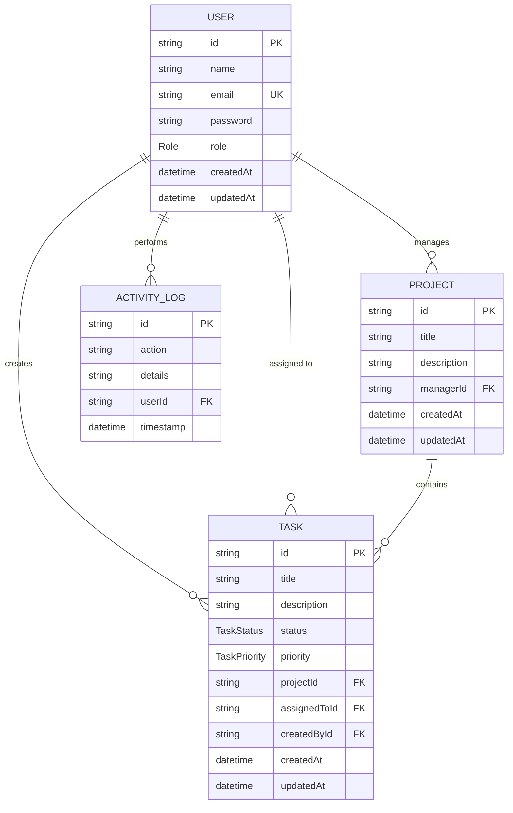

# 🛡️ RBAC Master — Complete Project Specifications & Technical Blueprint

This document provides a highly detailed, comprehensive system architecture blueprint, database model schema, feature flow walkthrough, API design reference, and containerization specification for the **RBAC Master** platform.

---

## 🗂️ 1. Repository Structure & Directory Map

```
role-base-auth-assignment/
├── docs/
│   ├── dashboard.png                 # Dashboard Preview Screenshot
│   └── PROJECT_DETAILS.md            # [This File] Complete Project Specifications
├── backend/
│   ├── prisma/
│   │   ├── schema.prisma             # PostgreSQL Schema Model
│   │   └── seed.ts                   # Seed Script for Users, Projects, Tasks
│   ├── src/
│   │   ├── config/
│   │   │   └── prisma.ts             # Prisma Client Instantiation
│   │   ├── controllers/
│   │   │   ├── activity.controller.ts # Audit logs handler
│   │   │   ├── auth.controller.ts     # User authentication handler
│   │   │   ├── project.controller.ts  # Workspace projects handler
│   │   │   ├── task.controller.ts     # Task management handler
│   │   │   └── user.controller.ts     # User accounts and roles management
│   │   ├── middlewares/
│   │   │   ├── auth.middleware.ts     # JWT verify & allowRoles middleware
│   │   │   └── validation.middleware.ts # Zod Input Payload validator
│   │   ├── routes/
│   │   │   ├── activity.routes.ts     # /api/activity routing
│   │   │   ├── auth.routes.ts         # /api/auth routing
│   │   │   ├── index.ts               # Main router distributor
│   │   │   ├── project.routes.ts      # /api/projects routing
│   │   │   ├── task.routes.ts         # /api/tasks routing
│   │   │   └── user.routes.ts         # /api/users routing
│   │   ├── schemas/
│   │   │   ├── auth.schema.ts         # Zod schemas for Login, Register, Profile
│   │   │   ├── project.schema.ts      # Zod schemas for Project creation/edit
│   │   │   ├── task.schema.ts         # Zod schemas for Task creation/edit/query
│   │   │   └── user.schema.ts         # Zod schemas for User creation/edit
│   │   ├── services/
│   │   │   ├── activity.service.ts    # DB queries for audit trails
│   │   │   ├── auth.service.ts        # Authentication business logic
│   │   │   ├── project.service.ts     # Project database actions
│   │   │   ├── task.service.ts        # Paginated tasks business logic
│   │   │   └── user.service.ts        # User CRUD database actions
│   │   ├── utils/
│   │   │   ├── jwt.ts                 # JWT signing and verification helpers
│   │   │   ├── logger.ts              # Asynchronous logActivity logger
│   │   │   └── response.ts            # Uniform Express response utilities
│   │   └── index.ts                  # Backend entry point
│   ├── .env.example                  # Environment Variables template
│   ├── Dockerfile.backend            # Production Docker image configuration
│   └── package.json                  # Backend dependencies and run scripts
├── frontend/
│   ├── app/
│   │   ├── (auth)/login/
│   │   │   └── page.tsx              # Login page & quick auto-fill helpers
│   │   ├── dashboard/
│   │   │   └── page.tsx              # Scoped dashboard overview metrics
│   │   ├── users/
│   │   │   └── page.tsx              # User CRUD admin control grid
│   │   ├── projects/
│   │   │   └── page.tsx              # Project control table
│   │   ├── tasks/
│   │   │   └── page.tsx              # Dynamic task backlog (paginated, search, filter)
│   │   ├── activity/
│   │   │   └── page.tsx              # Live system audit logs feed (Admin Only)
│   │   ├── profile/
│   │   │   └── page.tsx              # Profile metadata update
│   │   ├── 403/
│   │   │   └── page.tsx              # Access denied error screen
│   │   ├── layout.tsx                # Context provider wrappers & grid layout
│   │   └── page.tsx                  # Root redirection gateway
│   ├── components/
│   │   ├── Navbar.tsx                # Top navigation header
│   │   ├── Sidebar.tsx               # Left navigation menu list
│   │   ├── Modal.tsx                 # Pop-up container for forms
│   │   └── ProtectedRoute.tsx        # Client-side route-guarding mechanism
│   ├── context/
│   │   └── AuthContext.tsx           # Global session state provider
│   ├── lib/
│   │   └── api.ts                    # Axios wrapper & interceptor config
│   ├── Dockerfile.frontend           # Frontend Next.js Docker configuration
│   └── package.json                  # Frontend dependencies and Next.js scripts
├── docker-compose.yml                # Docker compose stack file
├── .dockerignore                     # Docker ignore rules
└── README.md                         # Main repository readme
```

---

## 🔒 2. Role-Based Access Control (RBAC) Security Model

### A. Roles Matrix
The platform defines three strict hierarchical roles using database-level `enum` checks:

1.  **`ADMIN`**: Full platform authority. Admins manage system accounts (create/update roles/delete users), create/delete projects, assign tasks to any manager/employee, and view the central audit activity database.
2.  **`MANAGER`**: Project management authority. Managers manage projects assigned to them. They can create/update/delete tasks under their projects, assign tasks to employees, and track project metrics.
3.  **`EMPLOYEE`**: Operational worker authority. Employees can view their assigned task backlog and update task statuses (`TODO` → `IN_PROGRESS` → `COMPLETED`). They cannot create users, tasks, or projects.

### B. Route Protection Middleware Flow
On the backend, request security is handled by [backend/src/middlewares/auth.middleware.ts](file:///e:/fullstack/role-base-auth-assignment/backend/src/middlewares/auth.middleware.ts):

*   **`verifyJWT`**:
    *   Reads the `Authorization` request header.
    *   Verifies the format `Bearer <token>`.
    *   Decodes the token using the secret key (`JWT_SECRET`).
    *   Performs a database check to ensure the user exists.
    *   Attaches the current user object to the request context: `req.user = user`.
*   **`allowRoles(...allowedRoles)`**:
    *   Checks if the user's role exists inside the allowed parameter list.
    *   If missing, returns `403 Forbidden: Role 'ROLE' is not authorized to access this resource`.
    *   If present, permits request flow to the controller.

---

## 🗄️ 3. Database Schema Blueprint (Prisma & PostgreSQL)

The database schema is described in [backend/prisma/schema.prisma](file:///e:/fullstack/role-base-auth-assignment/backend/prisma/schema.prisma).

### A. Entity Relationship Diagram (Conceptual)


### B. Table Constraints & Schemas
*   **`User`**:
    *   `id`: `String` (UUID) - Primary Key.
    *   `email`: `String` - Unique index, case-insensitive checks during login/registration.
    *   `role`: `Role` (Enum: `ADMIN`, `MANAGER`, `EMPLOYEE`) - Defaults to `EMPLOYEE`.
*   **`Project`**:
    *   `id`: `String` (UUID) - Primary Key.
    *   `managerId`: `String` - References `User(id)`.
    *   `onDelete`: `Cascade` - Deleting a manager's user account drops projects (in standard workflows) or projects cascade delete.
*   **`Task`**:
    *   `id`: `String` (UUID) - Primary Key.
    *   `status`: `TaskStatus` (Enum: `TODO`, `IN_PROGRESS`, `COMPLETED`) - Defaults to `TODO`.
    *   `priority`: `TaskPriority` (Enum: `LOW`, `MEDIUM`, `HIGH`) - Defaults to `MEDIUM`.
    *   `assignedToId`: `String` - References `User(id)`, `onDelete: SetNull` ensures tasks don't get deleted if an assignee is removed.
    *   `createdById`: `String` - References `User(id)`, `onDelete: Cascade`.
*   **`ActivityLog`**:
    *   `id`: `String` (UUID) - Primary Key.
    *   `userId`: `String` - References `User(id)`, `onDelete: SetNull` retains logs even if users are removed from the database.

---

## ⚡ 4. Feature Flow Walkthroughs

### A. Authentication & One-Click Auto-Fill Login
1.  **Frontend Rendering**: [frontend/app/login/page.tsx](file:///e:/fullstack/role-base-auth-assignment/frontend/app/login/page.tsx) renders three role assist buttons.
2.  **State Loading**: Clicking "Admin", "Manager", or "Employee" executes `fillCredentials()`, setting `email` state variables (e.g. `admin@rbac.com`) and `password` to `Password123!`.
3.  **API Dispatch**: Form submit triggers `login(email, password)` via `AuthContext.tsx`.
4.  **Backend Authentication**: The endpoint `POST /api/auth/login` uses `bcrypt.compare` to verify the credentials.
5.  **Token Persistence**: The backend returns a signed JWT. The frontend receives it, saves it to `localStorage.setItem("token", token)`, updates the React context user state, and redirects the user to the `/dashboard`.
6.  **HTTP Request Injection**: Every subsequent API request made by the custom Axios instance ([frontend/lib/api.ts](file:///e:/fullstack/role-base-auth-assignment/frontend/lib/api.ts)) uses an interceptor to automatically insert the header: `Authorization: Bearer <token>`.

### B. Pagination, Search, and Filtering Engine
The task catalog uses database-level pagination, query filters, and keyword search.

*   **Query Input**: A typical frontend request is structure as:
    `GET /api/tasks?page=2&limit=5&search=Navbar&status=IN_PROGRESS`
*   **Logical Handler**: [backend/src/services/task.service.ts](file:///e:/fullstack/role-base-auth-assignment/backend/src/services/task.service.ts#L14):
    *   **Pagination offset**: `skip = (page - 1) * limit`.
    *   **Dynamic `where` clause build**:
        *   If `search` is present, it constructs `contains` query clauses with `mode: "insensitive"` on the `title` and `description` fields.
        *   Appends `status`, `priority`, or `projectId` filter variables if they are set.
        *   Appends Role boundary filters: Managers see tasks they created/managed, employees see tasks assigned to them, admins see all.
    *   **Concurrent DB hit**: Executes `prisma.task.findMany` with the `where` constraints, `skip`, and `take` params alongside `prisma.task.count` to calculate page sizes.
    *   **Response mapping**: Sends a clean dataset to the frontend:
        ```json
        {
          "status": "success",
          "data": {
            "tasks": [...],
            "meta": { "total": 12, "page": 2, "limit": 5, "totalPages": 3 }
          }
        }
        ```

### C. System Activity Logging (Audit Trail)
The activity logs engine is implemented to track and persist security-sensitive system mutations.

*   **Call Execution**: When a controller changes the state of the database, it invokes `logActivity(action, userId, details)` asynchronously.
*   **Asynchronous Creation**: The helper uses `prisma.activityLog.create` inside a try-catch block, ensuring that if logging fails, the main business transaction is not rolled back.
*   **Metadata tracking**: Stores the exact action, timestamp, and a readable detail description.
*   **Client Display**: The `ADMIN` clicks the "Activity Logs" tab. The frontend requests `GET /api/activity`. The table renders logs ordered by `timestamp desc`.

---

## 📡 5. Complete API Reference

### Auth Endpoints (`/api/auth`)

#### 1. Login User
*   **Endpoint**: `POST /api/auth/login`
*   **Access**: Public
*   **Payload (JSON)**:
    ```json
    {
      "email": "admin@rbac.com",
      "password": "Password123!"
    }
    ```
*   **Success Response (200 OK)**:
    ```json
    {
      "status": "success",
      "message": "Login successful",
      "data": {
        "token": "eyJhbGciOiJIUzI1NiIsInR5cCI6IkpXVCJ9...",
        "user": {
          "id": "u-uuid-here",
          "name": "Alex Admin",
          "email": "admin@rbac.com",
          "role": "ADMIN",
          "createdAt": "2026-07-24T10:00:00Z"
        }
      }
    }
    ```

#### 2. Register Account
*   **Endpoint**: `POST /api/auth/register`
*   **Access**: Public
*   **Payload (JSON)**:
    ```json
    {
      "name": "John Doe",
      "email": "john@rbac.com",
      "password": "Password123!",
      "role": "EMPLOYEE"
    }
    ```
*   **Success Response (201 Created)**:
    ```json
    {
      "status": "success",
      "message": "Registration successful",
      "data": {
        "token": "eyJhb...",
        "user": { "id": "u-uuid-2", "name": "John Doe", "email": "john@rbac.com", "role": "EMPLOYEE" }
      }
    }
    ```

#### 3. Retrieve Self Profile
*   **Endpoint**: `GET /api/auth/me`
*   **Access**: Authenticated (JWT)
*   **Success Response (200 OK)**:
    ```json
    {
      "status": "success",
      "data": {
        "id": "u-uuid-here",
        "name": "Alex Admin",
        "email": "admin@rbac.com",
        "role": "ADMIN"
      }
    }
    ```

---

### User Endpoints (`/api/users`)

#### 1. List All Users
*   **Endpoint**: `GET /api/users`
*   **Access**: Authenticated (`ADMIN` or `MANAGER` roles only)
*   **Success Response (200 OK)**:
    ```json
    {
      "status": "success",
      "data": [
        {
          "id": "u-uuid-1",
          "name": "Alex Admin",
          "email": "admin@rbac.com",
          "role": "ADMIN",
          "_count": { "managedProjects": 2, "assignedTasks": 0 }
        }
      ]
    }
    ```

#### 2. Create User Account
*   **Endpoint**: `POST /api/users`
*   **Access**: Authenticated (`ADMIN` only)
*   **Payload (JSON)**:
    ```json
    {
      "name": "New Manager",
      "email": "newmanager@rbac.com",
      "password": "Password123!",
      "role": "MANAGER"
    }
    ```
*   **Success Response (201 Created)**:
    ```json
    {
      "status": "success",
      "data": {
        "id": "u-uuid-new",
        "name": "New Manager",
        "email": "newmanager@rbac.com",
        "role": "MANAGER"
      }
    }
    ```

#### 3. Update User
*   **Endpoint**: `PATCH /api/users/:id`
*   **Access**: Authenticated (`ADMIN` only)
*   **Payload (JSON)**: `{ "role": "ADMIN" }`
*   **Success Response (200 OK)**:
    ```json
    {
      "status": "success",
      "data": { "id": "u-uuid-new", "email": "newmanager@rbac.com", "role": "ADMIN" }
    }
    ```

#### 4. Delete User Account
*   **Endpoint**: `DELETE /api/users/:id`
*   **Access**: Authenticated (`ADMIN` only)
*   **Success Response (200 OK)**:
    ```json
    {
      "status": "success",
      "message": "User deleted successfully"
    }
    ```

---

### Project Endpoints (`/api/projects`)

#### 1. Fetch Projects List
*   **Endpoint**: `GET /api/projects`
*   **Access**: Authenticated (All Roles - Results scoped automatically based on active role)
*   **Success Response (200 OK)**:
    ```json
    {
      "status": "success",
      "data": [
        {
          "id": "p-uuid-1",
          "title": "Mobile App Redesign",
          "description": "Upgrade application visual aesthetics.",
          "manager": { "id": "m-uuid-1", "name": "Eddie Employee" },
          "_count": { "tasks": 4 }
        }
      ]
    }
    ```

#### 2. Create Project
*   **Endpoint**: `POST /api/projects`
*   **Access**: Authenticated (`ADMIN` only)
*   **Payload (JSON)**:
    ```json
    {
      "title": "Mobile App Redesign",
      "description": "Theme migration project",
      "managerId": "m-uuid-1"
    }
    ```
*   **Success Response (201 Created)**:
    ```json
    {
      "status": "success",
      "data": { "id": "p-uuid-1", "title": "Mobile App Redesign" }
    }
    ```

#### 3. Modify Project
*   **Endpoint**: `PATCH /api/projects/:id`
*   **Access**: Authenticated (`ADMIN` or managing `MANAGER` only)
*   **Payload (JSON)**: `{ "title": "Updated Title" }`
*   **Success Response (200 OK)**:
    ```json
    {
      "status": "success",
      "data": { "id": "p-uuid-1", "title": "Updated Title" }
    }
    ```

#### 4. Delete Project
*   **Endpoint**: `DELETE /api/projects/:id`
*   **Access**: Authenticated (`ADMIN` only)
*   **Success Response (200 OK)**:
    ```json
    {
      "status": "success",
      "message": "Project deleted successfully"
    }
    ```

---

### Task Endpoints (`/api/tasks`)

#### 1. Fetch Paginated Tasks
*   **Endpoint**: `GET /api/tasks`
*   **Access**: Authenticated (All Roles - Results scoped according to permissions)
*   **Query Parameters**:
    *   `page`: Number (Default `1`)
    *   `limit`: Number (Default `10`)
    *   `search`: String
    *   `status`: `"TODO"` | `"IN_PROGRESS"` | `"COMPLETED"`
    *   `priority`: `"LOW"` | `"MEDIUM"` | `"HIGH"`
    *   `projectId`: String
*   **Success Response (200 OK)**:
    ```json
    {
      "status": "success",
      "data": {
        "tasks": [
          {
            "id": "t-uuid-1",
            "title": "Build API Middleware",
            "description": "Create allowRoles functions.",
            "status": "IN_PROGRESS",
            "priority": "HIGH",
            "project": { "id": "p-uuid-1", "title": "RBAC Security Platform" },
            "assignedTo": { "id": "u-uuid-2", "email": "employee@rbac.com" },
            "createdBy": { "id": "u-uuid-1", "email": "manager@rbac.com" }
          }
        ],
        "meta": { "total": 1, "page": 1, "limit": 10, "totalPages": 1 }
      }
    }
    ```

#### 2. Create Task
*   **Endpoint**: `POST /api/tasks`
*   **Access**: Authenticated (`ADMIN` or project managing `MANAGER` only)
*   **Payload (JSON)**:
    ```json
    {
      "title": "Build API Middleware",
      "description": "Create allowRoles functions.",
      "priority": "HIGH",
      "status": "TODO",
      "projectId": "p-uuid-1",
      "assignedToId": "u-uuid-2"
    }
    ```
*   **Success Response (201 Created)**:
    ```json
    {
      "status": "success",
      "data": { "id": "t-uuid-1", "title": "Build API Middleware" }
    }
    ```

#### 3. Modify Task Details
*   **Endpoint**: `PATCH /api/tasks/:id`
*   **Access**: Authenticated (Admins, Managers, and assigned Employees)
    *   *Note: If request user is an `EMPLOYEE`, payload is stripped to `{ status }` only. The employee must also be the current assignee of that task.*
*   **Payload (JSON)**:
    ```json
    {
      "status": "IN_PROGRESS"
    }
    ```
*   **Success Response (200 OK)**:
    ```json
    {
      "status": "success",
      "data": { "id": "t-uuid-1", "status": "IN_PROGRESS" }
    }
    ```

#### 4. Delete Task
*   **Endpoint**: `DELETE /api/tasks/:id`
*   **Access**: Authenticated (`ADMIN` or task creator `MANAGER` only)
*   **Success Response (200 OK)**:
    ```json
    {
      "status": "success",
      "message": "Task deleted successfully"
    }
    ```

---

### Activity Log Endpoints (`/api/activity`)

#### 1. Get Audit Trail Logs
*   **Endpoint**: `GET /api/activity`
*   **Access**: Authenticated (`ADMIN` only)
*   **Success Response (200 OK)**:
    ```json
    {
      "status": "success",
      "message": "Activity logs retrieved successfully",
      "data": [
        {
          "id": "log-uuid-1",
          "action": "CREATE_TASK",
          "details": "ADMIN Alex Admin created task 'Implement JWT Middleware' (Assigned: Eddie Employee)",
          "timestamp": "2026-07-24T16:24:00.000Z",
          "user": {
            "id": "u-uuid-1",
            "name": "Alex Admin",
            "email": "admin@rbac.com",
            "role": "ADMIN"
          }
        }
      ]
    }
    ```

---

## 🐳 6. Infrastructure & Deployment Configurations

The platform is designed to run in isolated Docker containers managed via Docker Compose.

### A. Docker Compose File (`docker-compose.yml`)
```yaml
services:
  db:
    image: postgres:15-alpine
    container_name: rbac_postgres_db
    restart: always
    environment:
      POSTGRES_USER: rbac_user
      POSTGRES_PASSWORD: rbac_password
      POSTGRES_DB: rbac_db
    ports:
      - "5432:5432"
    volumes:
      - postgres_data:/var/lib/postgresql/data

  backend:
    build:
      context: ./backend
      dockerfile: Dockerfile.backend
    container_name: rbac_express_backend
    restart: always
    ports:
      - "5000:5000"
    environment:
      PORT: 5000
      DATABASE_URL: "postgresql://rbac_user:rbac_password@db:5432/rbac_db?schema=public"
      JWT_SECRET: "super-secret-rbac-jwt-key"
    depends_on:
      - db

  frontend:
    build:
      context: ./frontend
      dockerfile: Dockerfile.frontend
    container_name: rbac_nextjs_frontend
    restart: always
    ports:
      - "3000:3000"
    environment:
      NEXT_PUBLIC_API_URL: "http://localhost:5000/api"
    depends_on:
      - backend

volumes:
  postgres_data:
```

### B. Dockerfile for Backend (`Dockerfile.backend`)
```dockerfile
FROM node:18-alpine

WORKDIR /app

COPY package*.json ./

RUN npm install

COPY . .

RUN npx prisma generate

RUN npm run build

EXPOSE 5000

CMD ["sh", "-c", "npx prisma db push && npx prisma db seed && npm run start"]
```

### C. Dockerfile for Frontend (`Dockerfile.frontend`)
```dockerfile
FROM node:18-alpine

WORKDIR /app

COPY package*.json ./

RUN npm install

COPY . .

RUN npm run build

EXPOSE 3000

CMD ["npm", "run", "start"]
```
